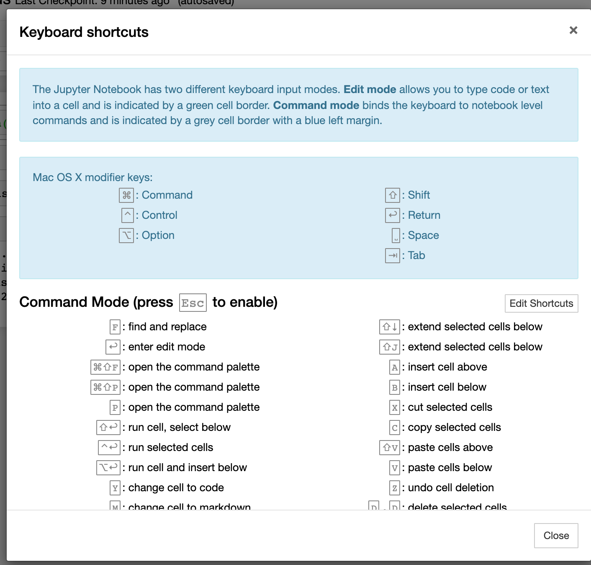

## Overview

Sample python scripts from python-data-analysis course on Linkedin Learning  (https://www.linkedin.com/learning/python-data-analysis-2015).

My objectives are to 
- enhance my python scripting
- starting moving from python2.7 to python3.x
- familiarizer myself with python numpy, pandas, matplotlib (I've already done simple line charts with pylab)
- work with jupyter notebook

## Setup

I've been using both python3 (3.7) (installed via brew)

```
~/projects/python-data-analysis $ python3
Python 3.7.7 (default, Mar 10 2020, 15:43:03)
[Clang 11.0.0 (clang-1100.0.33.17)] on darwin
Type "help", "copyright", "credits" or "license" for more information.
>>> import numpy
Traceback (most recent call last):
  File "<stdin>", line 1, in <module>
>>> exit()
```

and especially regular python (2.7) for quite a while 
```
~/projects/python-data-analysis $ python
Python 2.7.10 (default, Feb 22 2019, 21:55:15)
[GCC 4.2.1 Compatible Apple LLVM 10.0.1 (clang-1001.0.37.14)] on darwin
Type "help", "copyright", "credits" or "license" for more information.
>>> import numpy
>>> import panda
Traceback (most recent call last):
  File "<stdin>", line 1, in <module>
ImportError: No module named panda
>>> import pandas
Traceback (most recent call last):
  File "<stdin>", line 1, in <module>
ImportError: No module named pandas
>>> import matplotlib
>>>
```


For this course, I want to use `Anaconda`

> Anaconda is a free and open-source distribution of the Python and R programming languages for scientific computing, that aims to simplify package management and deployment. Package versions are managed by the package management system conda.

so again using brew

```
~/projects/python-data-analysis $ brew cask install anaconda
Updating Homebrew...
==> Auto-updated Homebrew!
Updated 2 taps (homebrew/core and homebrew/cask).
==> New Formulae
...
```


finally and I think I like this (no affect on my regular python usage) you need to use the z-shell (I'm typically a bash shell person)

```
~ $ cat ~/.zshrc
export PATH="/usr/local/anaconda3/bin:$PATH"
```

now I can use Anaconda python 

```
Last login: Thu Mar 26 20:30:22 on ttys014
~ $ zsh
Daves-MacBook-Pro% python
Python 3.7.4 (default, Aug 13 2019, 15:17:50)
[Clang 4.0.1 (tags/RELEASE_401/final)] :: Anaconda, Inc. on darwin
Type "help", "copyright", "credits" or "license" for more information.
>>> import numpy
>>> import pandas
i>>> import matplotlib
>>> exit ()
```
and jupyter notebooks:
```
Daves-MacBook-Pro% jupyter notebook
[I 21:12:21.784 NotebookApp] The port 8888 is already in use, trying another port.
[I 21:12:21.846 NotebookApp] JupyterLab extension loaded from /usr/local/anaconda3/lib/python3.7/site-packages/jupyterlab
[I 21:12:21.846 NotebookApp] JupyterLab application directory is /usr/local/anaconda3/share/jupyter/lab
[I 21:12:21.848 NotebookApp] Serving notebooks from local directory: /Users/dpitts
[I 21:12:21.849 NotebookApp] The Jupyter Notebook is running at:
[I 21:12:21.849 NotebookApp] http://localhost:8889/?token=4bfb635934506cbc764660146e2e6d019f8282e6fa260df1
[I 21:12:21.849 NotebookApp]  or http://127.0.0.1:8889/?token=4bfb635934506cbc764660146e2e6d019f8282e6fa260df1
[I 21:12:21.849 NotebookApp] Use Control-C to stop this server and shut down all kernels (twice to skip confirmation).
[C 21:12:21.855 NotebookApp]

    To access the notebook, open this file in a browser:
        file:///Users/dpitts/Library/Jupyter/runtime/nbserver-93038-open.html
    Or copy and paste one of these URLs:
        http://localhost:8889/?token=4bfb635934506cbc764660146e2e6d019f8282e6fa260df1
     or http://127.0.0.1:8889/?token=4bfb635934506cbc764660146e2e6d019f8282e6fa260df1
^C[I 21:12:36.561 NotebookApp] interrupted
Serving notebooks from local directory: /Users/dpitts
0 active kernels
The Jupyter Notebook is running at:
http://localhost:8889/?token=4bfb635934506cbc764660146e2e6d019f8282e6fa260df1
 or http://127.0.0.1:8889/?token=4bfb635934506cbc764660146e2e6d019f8282e6fa260df1
Shutdown this notebook server (y/[n])? No answer for 5s: resuming operation...
```

### A little Help with getting started with Jupyter Notebooks

Sounds a bit like vi i.e. a good start
{quote}
First, we need to know that they are 2 modes in the Jupyter Notebook App: command mode and edit mode.
https://towardsdatascience.com/jypyter-notebook-shortcuts-bf0101a98330
{quote}

The most important key to know is H for help, which appeaars to OS context sensitive:

 


### ex02-05-namedtuples-python27-script.py

Ref: https://pymotw.com/2/collections/namedtuple.html
```
~/projects/python-data-analysis $ cat ex02-05-namedtuples-python27-script.py
import collections
Person = collections.namedtuple('Person', 'name age gender')

print 'Type of Person:', type(Person)

bob = Person(name='Bob', age=30, gender='male')
print '\nRepresentation:', bob

jane = Person(name='Jane', age=29, gender='female')
print '\nField by name:', jane.name

print '\nFields by index:'
for p in [ bob, jane ]:
    print '%s is a %d year old %s' % p
```
output
```
~/projects/python-data-analysis $ python2.7 ex02-05-namedtuples-python27-script.py
Type of Person: <type 'type'>

Representation: Person(name='Bob', age=30, gender='male')

Field by name: Jane

Fields by index:
Bob is a 30 year old male
Jane is a 29 year old female
```


### ex03-text-manipulation-and-files

One confusing thing for me with jupyter is how to know and/or set my working directory within the host OS filesysteM? 
So needed to python ues the os package 

```
import os
arr = os.listdir()
print(arr)
```
https://stackoverflow.com/questions/3207219/how-do-i-list-all-files-of-a-directory

Also I was curious to load data from a more interesting dataset i.e. a txt version of Percy Bysshe Shelley's "Prometheus Unbound" (http://www.gutenberg.org/cache/epub/4797/pg4797.txt), but then I also need to convert words into lines

```
You need str.split() to split each string into words:
word_list = [word for line in sentence for word in line.split()]
```
https://stackoverflow.com/questions/8478602/convert-a-list-of-string-sentences-to-words


